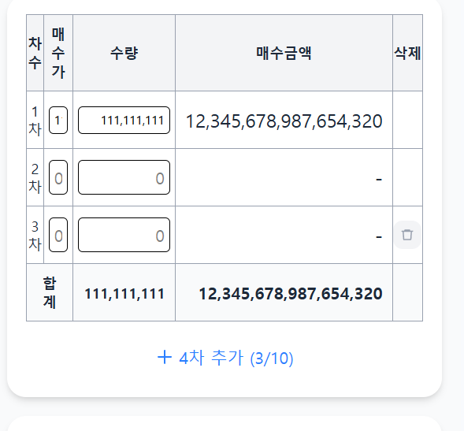
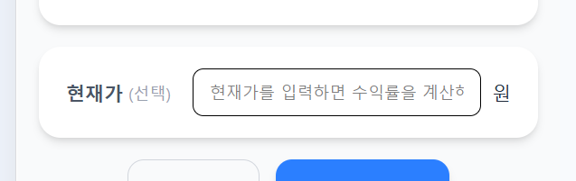

# stock 요구사항 정의서

## 1. 평균 단가 계산기 (avg-price)
- [x] PC 웹화면에서는 표가 깨지지 않으나 모바일 웹화면에서는 표가 깨짐
  - 상황: 매수가 9자리 입력 후 수량을 9자리까지 입력하면 표가 깨짐
  - 현상: 차수, 매수가 컬럼 줄어듬
  - 목표: 차수, 매수가, 수량 컬럼이 줄어들지 않은 상태에서 매수금액 컬럼이 늘어나고 매수금액 컬럼이 늘어난 만큼 흰색 바탕에 좌우 스크롤이 발생하는 방식으로 변경 희망
  *참고:* 

- [x] 현재가를 입력하면 수익률을 계산해드려요 문구 input 크기에 맞게 폰트 크기 조절
  - 상황: PC 웹화면에서는 문구가 다 나와나 모바일 웹화면에서는 문구가 다 나오지 않음
  - 현상: 
  - 목표: 문가가 input 크기에 맞게 폰트 크기를 자동 조절

## 2. 수익률 계산기 (profit-rate)
- [ ] 신규 요구사항 등록 예시

